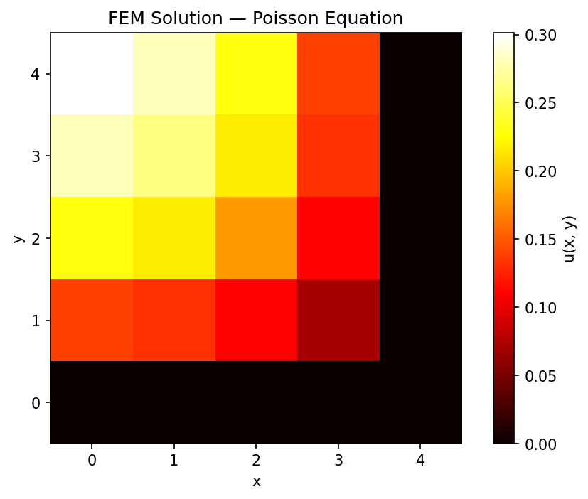

# Finite Element Method

From-scratch implementations of the Finite Element Method (FEM) in Python and C, applied to two physical problems. Each solution derives the weak form using the Rayleigh-Ritz method, assembles the global stiffness matrix element by element, and solves the resulting linear system with a custom numerical solver.

---

## 1. Poisson Equation on a Square Plate — Python

### Problem

Solve the 2D Poisson equation on a square domain with homogeneous Dirichlet boundary conditions:

$$-\left(\frac{\partial^2 u}{\partial x^2} + \frac{\partial^2 u}{\partial y^2}\right) = f_0, \qquad u = 0 \text{ on } \Gamma$$

The diagonal symmetry of the domain reduces the problem to a triangular region discretized with **15 nodes** and **15 linear triangular elements**.

### Approach

The weak form is derived by multiplying by a test function φ and applying the divergence theorem:

$$\iint \left[\frac{\partial\phi}{\partial x}\frac{\partial u}{\partial x} + \frac{\partial\phi}{\partial y}\frac{\partial u}{\partial y}\right]dxdy = \iint \phi\, f_0\, dxdy$$

Linear shape functions N₁, N₂, N₃ are used over each triangular element to build the master stiffness matrix, which is then assembled into the global system KU = f and solved with **Gaussian elimination with partial pivoting**.

### Master Element

$$\frac{1}{2}\begin{pmatrix} 1 & -1 & 0 \\ -1 & 2 & -1 \\ 0 & -1 & 1 \end{pmatrix} \begin{pmatrix} U_1 \\ U_2 \\ U_3 \end{pmatrix} = \frac{f_0}{6} \begin{pmatrix} 1 \\ 1 \\ 1 \end{pmatrix}$$

### Solution



### Run

```bash
pip install numpy matplotlib
python poisson-equation/poisson_fem.py
```

---

## 2. Spring-Mass-Damper System — C

### Problem

Find the initial velocity of a damped spring-mass system such that the first full oscillation cycle lasts 6.4 s:

$$\ddot{x} + 0.8\dot{x} + x = 0, \qquad x(0) = 1 \text{ cm}, \quad \dot{x}(t_{i+1}) = 0$$

### Approach

The weak form is obtained by multiplying by a test function w and integrating by parts over each time element:

$$\int_{t_i}^{t_{i+1}} \left(0.8w\frac{dx}{dt} - \frac{dw}{dt}\frac{dx}{dt} + wx\right)dt = -w\left(\frac{dx}{dt}\right)_{t_i}$$

Linear shape functions N₁(ξ) = (1-ξ)/2 and N₂(ξ) = (1+ξ)/2 yield the master element. The global system is assembled by overlapping consecutive element matrices and solved with a custom **Gauss-Jordan elimination** implementation in C.

### Master Element

$$\begin{pmatrix} 1.5796 & 1.6239 \\ 0.8239 & 2.3796 \end{pmatrix} \begin{pmatrix} u_1 \\ u_2 \end{pmatrix} = \begin{pmatrix} \left(\frac{dx}{dt}\right)_{x_i} \\ \left(\frac{dx}{dt}\right)_{x_{i+1}} = 0 \end{pmatrix}$$

### Accuracy

FEM nodal values match the analytical solution x(t) = e^{−0.4t} cos(0.9165t) with high precision:

| Node | t (s) | FEM x (cm) | Analytical x (cm) |
|------|--------|------------|-------------------|
| 1    | 0      | 1.0000     | 1.0000            |
| 2    | 3.2    | −0.2421    | −0.2421           |
| 3    | 6.4    | 0.0838     | 0.0836            |

### Run

```bash
gcc spring-mass-damper/spring_mass_damper.c -o spring_mass_damper
./spring_mass_damper
```

---

## Stack

Python · NumPy · Matplotlib · C
